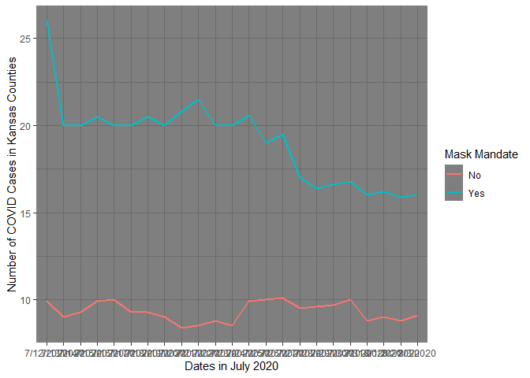

Lab 07 - Conveying the right message through visualisation
================
Ryan Wheat
03/7/2023

### Load packages and data

``` r
library(tidyverse) 
```

### Exercise 1

The thing that is so (purposefully) misleading about this graph is that
the two groups are not being graphed on the same y-axis.

Thus, at face-value, this visual seems to display how mask mandates are
more effective at reducing the number of COVID cases in counties that
adopt them than counties which do not, and that this leads to fewer
COVID cases overall.

Instead, this visual should show that mask mandates reduce COVID cases
in counties that adopt them – but that counties which don’t have mask
mandates still have fewer people test positive for COVID overall.

``` r
df <- tribble(
  ~date, ~count, ~mandate,
  "7/12/2020", 26, "Yes",
  "7/12/2020", 9.9, "No",
  "7/13/2020", 20,"Yes",
  "7/13/2020", 9, "No",
  "7/14/2020", 20, "Yes",
  "7/14/2020", 9.3, "No",
  "7/15/2020", 20.5, "Yes",
  "7/15/2020", 9.9, "No",
  "7/16/2020", 20, "Yes",
  "7/16/2020", 10, "No",
  "7/17/2020", 20, "Yes",
  "7/17/2020", 9.3, "No",
  "7/18/2020", 20.5, "Yes",
  "7/18/2020", 9.3, "No",
  "7/19/2020", 20, "Yes",
  "7/19/2020", 9, "No",
  "7/20/2020", 20.8, "Yes",
  "7/20/2020", 8.4, "No",
  "7/21/2020", 21.5, "Yes",
  "7/21/2020", 8.5, "No",
  "7/22/2020", 20, "Yes",
  "7/22/2020", 8.8, "No",
  "7/23/2020", 20, "Yes",
  "7/23/2020", 8.5, "No",
  "7/24/2020", 20.6, "Yes",
  "7/24/2020", 9.9, "No",
  "7/25/2020", 19, "Yes",
  "7/25/2020", 10, "No",
  "7/26/2020", 19.5, "Yes",
  "7/26/2020", 10.1, "No",
  "7/27/2020", 17, "Yes",
  "7/27/2020", 9.5, "No",
  "7/28/2020", 16.4, "Yes",
  "7/28/2020", 9.6, "No",
  "7/29/2020", 16.6, "Yes",
  "7/29/2020", 9.7, "No",
  "7/30/2020", 16.8, "Yes",
  "7/30/2020", 10, "No",
  "7/31/2020", 16, "Yes",
  "7/31/2020", 8.8, "No",
  "8/1/2020", 16.2, "Yes",
  "8/1/2020", 9, "No",
  "8/2/2020", 15.9, "Yes",
  "8/2/2020", 8.8, "No",
  "8/3/2020", 16, "Yes",
  "8/3/2020", 9.1, "No",
)
```

### Exercise 2

``` r
df %>%
  ggplot(aes(x = date, y = count, group = mandate, color = mandate)) + geom_line(linewidth = 1) + theme_dark() + labs(x = "Dates in July 2020", y = "Number of COVID Cases in Kansas Counties", color = "Mask Mandate")
```

<!-- -->

…

Add exercise headings as needed.
